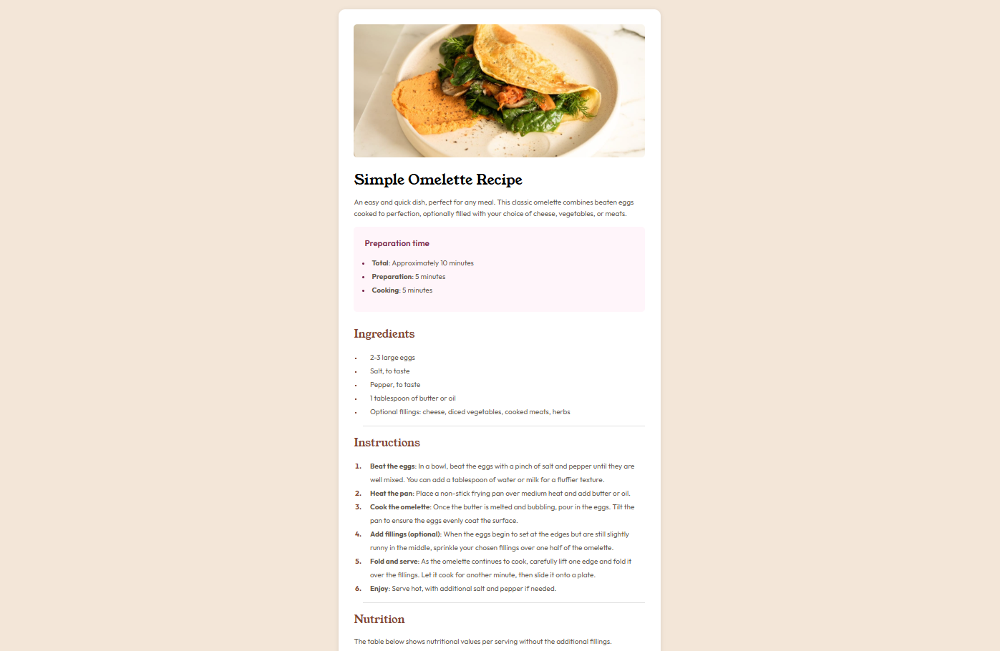

# Frontend Mentor - Recipe page solution

This is a solution to the [Recipe page challenge on Frontend Mentor](https://www.frontendmentor.io/challenges/recipe-page-KiTsR8QQKm). Frontend Mentor challenges help you improve your coding skills by building realistic projects. 

## Table of contents

- [Overview](#overview)
  - [Screenshot](#screenshot)
  - [Links](#links)
- [My process](#my-process)
  - [Built with](#built-with)
  - [What I learned](#what-i-learned)
  - [Continued development](#continued-development)
  - [Useful resources](#useful-resources)
- [Author](#author)
- [Acknowledgments](#acknowledgments)

## Overview

### Screenshot

### Links

- Solution URL: [solution URL](https://github.com/SamPreethJohn/Recipe-page)
- Live Site URL: [live site URL](https://sampreethjohn.github.io/Recipe-page/)

## My process

### Built with

- Semantic HTML5 markup
- CSS custom properties
- Flexbox
- CSS Grid

### What I learned

While working on this project, I improved my understanding of:

- Structuring semantic HTML

- Styling responsive card layouts with Flexbox and Grid

- Using CSS variables for maintainable themes

### Continued development

I want to focus more on:

- Advanced responsive techniques

- Accessibility best practices

- Making pixel-perfect layouts

### Useful resources

- [MDN Web Docs](https://developer.mozilla.org/en-US/) - My go-to reference for HTML and CSS.
- [CSS Tricks](https://css-tricks.com/) - Helped me with layout tricks using Flexbox.

## Author

- Website - [Sam Preeth John](https://sampreethjohn.github.io/Recipe-page/)
- Frontend Mentor - [@SamPreethJohn](https://www.frontendmentor.io/profile/SamPreethJohn)

## Acknowledgments

I’d like to thank Frontend Mentor for providing this challenge. It’s a great platform to sharpen real-world front-end skills. I also browsed a few other users’ solutions for inspiration on layout and responsiveness — their creativity and code quality motivated me to improve mine.
